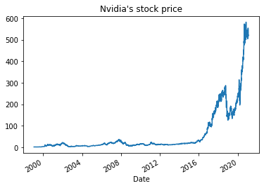

# StockMarket Processing and Analytics 
  

    
This quick tutorial will show you how to get started with StockMarket analytics using python and popular libraries to pull down trading data for which you can manipulate accordingly.      
  
### Demo Breakdown: 

- First example pulling data using **yfinance** 
- Second example using with **yahoofinancials**
- Stretch goal is using `Quandl, Intrinion, AlphaVantage, Tiingo, IEX Cloud`  
- Final section is repeating this with pyspark instead of Pandas. 

Ensure you run the following from terminal:  
  
#### Pandas Requirements 
  
```python
pip install pandas
```

     
     
#### Library Requirements 

```python
pip install yfinance

pip install yahoofinancials
```

   


```python
import pandas as pd
import yfinance as yf

```

#### NVDA Stock Market Data   

Nvidia are a well performing company, so will serve as a good use case for grabbing the trading data. 


```python
# Specify Dataframe and download past months figures
nvda_df = yf.download('NVDA', 
                      start='2021-01-01', 
                      end='2021-01-27', 
                      progress=False)  

# View the first fiew records 
nvda_df.head()
```

  
  


<div>
<style scoped>
    .dataframe tbody tr th:only-of-type {
        vertical-align: middle;
    }

    .dataframe tbody tr th {
        vertical-align: top;
    }

    .dataframe thead th {
        text-align: right;
    }
</style>
<table border="1" class="dataframe">
  <thead>
    <tr style="text-align: right;">
      <th></th>
      <th>Open</th>
      <th>High</th>
      <th>Low</th>
      <th>Close</th>
      <th>Adj Close</th>
      <th>Volume</th>
    </tr>
    <tr>
      <th>Date</th>
      <th></th>
      <th></th>
      <th></th>
      <th></th>
      <th></th>
      <th></th>
    </tr>
  </thead>
  <tbody>
    <tr>
      <th>2021-01-04</th>
      <td>524.169983</td>
      <td>546.099976</td>
      <td>518.500000</td>
      <td>524.539978</td>
      <td>524.539978</td>
      <td>14016000</td>
    </tr>
    <tr>
      <th>2021-01-05</th>
      <td>523.989990</td>
      <td>537.739990</td>
      <td>523.479980</td>
      <td>536.190002</td>
      <td>536.190002</td>
      <td>8069000</td>
    </tr>
    <tr>
      <th>2021-01-06</th>
      <td>528.900024</td>
      <td>529.799988</td>
      <td>503.440002</td>
      <td>504.579987</td>
      <td>504.579987</td>
      <td>14510600</td>
    </tr>
    <tr>
      <th>2021-01-07</th>
      <td>518.700012</td>
      <td>535.109985</td>
      <td>515.460022</td>
      <td>533.760010</td>
      <td>533.760010</td>
      <td>11537000</td>
    </tr>
    <tr>
      <th>2021-01-08</th>
      <td>534.500000</td>
      <td>536.840027</td>
      <td>521.679993</td>
      <td>531.070007</td>
      <td>531.070007</td>
      <td>7313200</td>
    </tr>
  </tbody>
</table>
</div>


## Specifying shorter intervals  

You can specify increments of #1m, 5m, 15m, 30m, 60m, 1h, 1d, 1wk, 1mo


```python

nvda_df = yf.download('NVDA', 
                      start='2021-01-25', 
                      end='2021-01-27', 
                      interval = '1h',
                      progress=False)
nvda_df
```


<div>
<style scoped>
    .dataframe tbody tr th:only-of-type {
        vertical-align: middle;
    }

    .dataframe tbody tr th {
        vertical-align: top;
    }

    .dataframe thead th {
        text-align: right;
    }
</style>
<table border="1" class="dataframe">
  <thead>
    <tr style="text-align: right;">
      <th></th>
      <th>Open</th>
      <th>High</th>
      <th>Low</th>
      <th>Close</th>
      <th>Adj Close</th>
      <th>Volume</th>
    </tr>
    <tr>
      <th>Date</th>
      <th></th>
      <th></th>
      <th></th>
      <th></th>
      <th></th>
      <th></th>
    </tr>
  </thead>
  <tbody>
    <tr>
      <th>2021-01-25</th>
      <td>551.270020</td>
      <td>553.140015</td>
      <td>546.552979</td>
      <td>546.960022</td>
      <td>546.960022</td>
      <td>1368130</td>
    </tr>
    <tr>
      <th>2021-01-25</th>
      <td>546.950012</td>
      <td>547.489990</td>
      <td>529.459229</td>
      <td>537.650024</td>
      <td>537.650024</td>
      <td>1682462</td>
    </tr>
    <tr>
      <th>2021-01-25</th>
      <td>538.270020</td>
      <td>541.880005</td>
      <td>535.630005</td>
      <td>536.794983</td>
      <td>536.794983</td>
      <td>619718</td>
    </tr>
    <tr>
      <th>2021-01-25</th>
      <td>536.539978</td>
      <td>545.030029</td>
      <td>535.900024</td>
      <td>544.760010</td>
      <td>544.760010</td>
      <td>616189</td>
    </tr>
    <tr>
      <th>2021-01-25</th>
      <td>544.690002</td>
      <td>546.809998</td>
      <td>543.690002</td>
      <td>544.523987</td>
      <td>544.523987</td>
      <td>471811</td>
    </tr>
    <tr>
      <th>2021-01-25</th>
      <td>544.429993</td>
      <td>545.349976</td>
      <td>540.690002</td>
      <td>541.503296</td>
      <td>541.503296</td>
      <td>388267</td>
    </tr>
    <tr>
      <th>2021-01-25</th>
      <td>541.338013</td>
      <td>546.849976</td>
      <td>540.813477</td>
      <td>546.390015</td>
      <td>546.390015</td>
      <td>659165</td>
    </tr>
    <tr>
      <th>2021-01-26</th>
      <td>543.217590</td>
      <td>545.789978</td>
      <td>537.520020</td>
      <td>541.380005</td>
      <td>541.380005</td>
      <td>1111140</td>
    </tr>
    <tr>
      <th>2021-01-26</th>
      <td>541.309998</td>
      <td>544.549988</td>
      <td>539.469971</td>
      <td>539.590027</td>
      <td>539.590027</td>
      <td>479635</td>
    </tr>
    <tr>
      <th>2021-01-26</th>
      <td>539.520020</td>
      <td>541.118713</td>
      <td>538.150024</td>
      <td>540.880371</td>
      <td>540.880371</td>
      <td>373148</td>
    </tr>
    <tr>
      <th>2021-01-26</th>
      <td>540.770020</td>
      <td>540.979980</td>
      <td>538.400024</td>
      <td>538.880127</td>
      <td>538.880127</td>
      <td>377132</td>
    </tr>
    <tr>
      <th>2021-01-26</th>
      <td>539.000000</td>
      <td>539.580017</td>
      <td>537.118896</td>
      <td>538.169983</td>
      <td>538.169983</td>
      <td>301722</td>
    </tr>
    <tr>
      <th>2021-01-26</th>
      <td>538.080505</td>
      <td>540.369995</td>
      <td>537.469971</td>
      <td>537.825012</td>
      <td>537.825012</td>
      <td>442544</td>
    </tr>
    <tr>
      <th>2021-01-26</th>
      <td>537.820007</td>
      <td>538.329895</td>
      <td>535.500000</td>
      <td>537.409973</td>
      <td>537.409973</td>
      <td>591493</td>
    </tr>
  </tbody>
</table>
</div>


# Multi Download

Same ideaas before, but this time we want to grab multiple companies with one search. 


```python
tickers = ['NVDA', 'BIO', 'ETSY']
multi_df = yf.download(tickers,
                      start='2020-01-25', 
                      end='2021-01-27', 
                      progress=True)
```

    [*********************100%***********************]  3 of 3 completed


```python
# Viewing first few rows. 
multi_df.head()

```


<div>
<style scoped>
    .dataframe tbody tr th:only-of-type {
        vertical-align: middle;
    }

    .dataframe tbody tr th {
        vertical-align: top;
    }

    .dataframe thead tr th {
        text-align: left;
    }

    .dataframe thead tr:last-of-type th {
        text-align: right;
    }
</style>
<table border="1" class="dataframe">
  <thead>
    <tr>
      <th></th>
      <th colspan="3" halign="left">Adj Close</th>
      <th colspan="3" halign="left">Close</th>
      <th colspan="3" halign="left">High</th>
      <th colspan="3" halign="left">Low</th>
      <th colspan="3" halign="left">Open</th>
      <th colspan="3" halign="left">Volume</th>
    </tr>
    <tr>
      <th></th>
      <th>BIO</th>
      <th>ETSY</th>
      <th>NVDA</th>
      <th>BIO</th>
      <th>ETSY</th>
      <th>NVDA</th>
      <th>BIO</th>
      <th>ETSY</th>
      <th>NVDA</th>
      <th>BIO</th>
      <th>ETSY</th>
      <th>NVDA</th>
      <th>BIO</th>
      <th>ETSY</th>
      <th>NVDA</th>
      <th>BIO</th>
      <th>ETSY</th>
      <th>NVDA</th>
    </tr>
    <tr>
      <th>Date</th>
      <th></th>
      <th></th>
      <th></th>
      <th></th>
      <th></th>
      <th></th>
      <th></th>
      <th></th>
      <th></th>
      <th></th>
      <th></th>
      <th></th>
      <th></th>
      <th></th>
      <th></th>
      <th></th>
      <th></th>
      <th></th>
    </tr>
  </thead>
  <tbody>
    <tr>
      <th>2020-01-27</th>
      <td>365.339996</td>
      <td>49.320000</td>
      <td>239.804306</td>
      <td>365.339996</td>
      <td>49.320000</td>
      <td>240.199997</td>
      <td>369.299988</td>
      <td>49.580002</td>
      <td>242.250000</td>
      <td>362.940002</td>
      <td>47.330002</td>
      <td>232.229996</td>
      <td>363.390015</td>
      <td>48.750000</td>
      <td>238.240005</td>
      <td>168700</td>
      <td>2196400</td>
      <td>11763400</td>
    </tr>
    <tr>
      <th>2020-01-28</th>
      <td>366.989990</td>
      <td>49.830002</td>
      <td>247.561493</td>
      <td>366.989990</td>
      <td>49.830002</td>
      <td>247.970001</td>
      <td>370.190002</td>
      <td>50.430000</td>
      <td>249.270004</td>
      <td>366.040009</td>
      <td>49.380001</td>
      <td>240.710007</td>
      <td>368.089996</td>
      <td>49.799999</td>
      <td>242.850006</td>
      <td>100200</td>
      <td>4233100</td>
      <td>7774400</td>
    </tr>
    <tr>
      <th>2020-01-29</th>
      <td>368.640015</td>
      <td>50.150002</td>
      <td>245.135498</td>
      <td>368.640015</td>
      <td>50.150002</td>
      <td>245.539993</td>
      <td>375.220001</td>
      <td>50.980000</td>
      <td>248.839996</td>
      <td>367.959991</td>
      <td>49.830002</td>
      <td>243.940002</td>
      <td>369.170013</td>
      <td>49.830002</td>
      <td>247.389999</td>
      <td>95700</td>
      <td>1903100</td>
      <td>6471200</td>
    </tr>
    <tr>
      <th>2020-01-30</th>
      <td>367.119995</td>
      <td>50.290001</td>
      <td>245.405060</td>
      <td>367.119995</td>
      <td>50.290001</td>
      <td>245.809998</td>
      <td>367.980011</td>
      <td>50.410000</td>
      <td>246.350006</td>
      <td>362.170013</td>
      <td>49.360001</td>
      <td>239.399994</td>
      <td>366.450012</td>
      <td>49.660000</td>
      <td>241.610001</td>
      <td>104000</td>
      <td>1654400</td>
      <td>7262600</td>
    </tr>
    <tr>
      <th>2020-01-31</th>
      <td>360.920013</td>
      <td>48.810001</td>
      <td>236.040497</td>
      <td>360.920013</td>
      <td>48.810001</td>
      <td>236.429993</td>
      <td>366.369995</td>
      <td>50.349998</td>
      <td>244.449997</td>
      <td>358.679993</td>
      <td>48.480000</td>
      <td>234.750000</td>
      <td>366.369995</td>
      <td>50.299999</td>
      <td>243.970001</td>
      <td>245900</td>
      <td>2127900</td>
      <td>9260500</td>
    </tr>
  </tbody>
</table>
</div>


## Modifying the auto_adjust parameter   
  
 The `auto_adjust = True` setting will present the data amended for all corporate actions such as splits.   
Lets see how different the data looks adding this parameter (difference is printed in the cell21. 


```python
# tickers already specified
multi_df_adjusted = yf.download(tickers,
                      start='2020-01-25', 
                      end='2021-01-27', 
                      auto_adjust = True,
                      progress=True)
multi_df_adjusted.head()
```

    [*********************100%***********************]  3 of 3 completed


<div>
<style scoped>
    .dataframe tbody tr th:only-of-type {
        vertical-align: middle;
    }

    .dataframe tbody tr th {
        vertical-align: top;
    }

    .dataframe thead tr th {
        text-align: left;
    }

    .dataframe thead tr:last-of-type th {
        text-align: right;
    }
</style>
<table border="1" class="dataframe">
  <thead>
    <tr>
      <th></th>
      <th colspan="3" halign="left">Close</th>
      <th colspan="3" halign="left">High</th>
      <th colspan="3" halign="left">Low</th>
      <th colspan="3" halign="left">Open</th>
      <th colspan="3" halign="left">Volume</th>
    </tr>
    <tr>
      <th></th>
      <th>BIO</th>
      <th>ETSY</th>
      <th>NVDA</th>
      <th>BIO</th>
      <th>ETSY</th>
      <th>NVDA</th>
      <th>BIO</th>
      <th>ETSY</th>
      <th>NVDA</th>
      <th>BIO</th>
      <th>ETSY</th>
      <th>NVDA</th>
      <th>BIO</th>
      <th>ETSY</th>
      <th>NVDA</th>
    </tr>
    <tr>
      <th>Date</th>
      <th></th>
      <th></th>
      <th></th>
      <th></th>
      <th></th>
      <th></th>
      <th></th>
      <th></th>
      <th></th>
      <th></th>
      <th></th>
      <th></th>
      <th></th>
      <th></th>
      <th></th>
    </tr>
  </thead>
  <tbody>
    <tr>
      <th>2020-01-27</th>
      <td>365.339996</td>
      <td>49.320000</td>
      <td>239.804306</td>
      <td>369.299988</td>
      <td>49.580002</td>
      <td>241.850932</td>
      <td>362.940002</td>
      <td>47.330002</td>
      <td>231.847434</td>
      <td>363.390015</td>
      <td>48.750000</td>
      <td>237.847543</td>
      <td>168700</td>
      <td>2196400</td>
      <td>11763400</td>
    </tr>
    <tr>
      <th>2020-01-28</th>
      <td>366.989990</td>
      <td>49.830002</td>
      <td>247.561493</td>
      <td>370.190002</td>
      <td>50.430000</td>
      <td>248.859354</td>
      <td>366.040009</td>
      <td>49.380001</td>
      <td>240.313459</td>
      <td>368.089996</td>
      <td>49.799999</td>
      <td>242.449933</td>
      <td>100200</td>
      <td>4233100</td>
      <td>7774400</td>
    </tr>
    <tr>
      <th>2020-01-29</th>
      <td>368.640015</td>
      <td>50.150002</td>
      <td>245.135498</td>
      <td>375.220001</td>
      <td>50.980000</td>
      <td>248.430065</td>
      <td>367.959991</td>
      <td>49.830002</td>
      <td>243.538143</td>
      <td>369.170013</td>
      <td>49.830002</td>
      <td>246.982457</td>
      <td>95700</td>
      <td>1903100</td>
      <td>6471200</td>
    </tr>
    <tr>
      <th>2020-01-30</th>
      <td>367.119995</td>
      <td>50.290001</td>
      <td>245.405060</td>
      <td>367.980011</td>
      <td>50.410000</td>
      <td>245.944179</td>
      <td>362.170013</td>
      <td>49.360001</td>
      <td>239.005616</td>
      <td>366.450012</td>
      <td>49.660000</td>
      <td>241.211982</td>
      <td>104000</td>
      <td>1654400</td>
      <td>7262600</td>
    </tr>
    <tr>
      <th>2020-01-31</th>
      <td>360.920013</td>
      <td>48.810001</td>
      <td>236.040497</td>
      <td>366.369995</td>
      <td>50.349998</td>
      <td>244.047289</td>
      <td>358.679993</td>
      <td>48.480000</td>
      <td>234.363272</td>
      <td>366.369995</td>
      <td>50.299999</td>
      <td>243.568084</td>
      <td>245900</td>
      <td>2127900</td>
      <td>9260500</td>
    </tr>
  </tbody>
</table>
</div>


```python
# This dataframe shows a preview of just how different the figures are after adjustment. 
diff_df=pd.concat([multi_df,multi_df_adjusted]).drop_duplicates(keep=False)
diff_df.head()

```


<div>
<style scoped>
    .dataframe tbody tr th:only-of-type {
        vertical-align: middle;
    }

    .dataframe tbody tr th {
        vertical-align: top;
    }

    .dataframe thead tr th {
        text-align: left;
    }

    .dataframe thead tr:last-of-type th {
        text-align: right;
    }
</style>
<table border="1" class="dataframe">
  <thead>
    <tr>
      <th></th>
      <th colspan="3" halign="left">Adj Close</th>
      <th colspan="3" halign="left">Close</th>
      <th colspan="3" halign="left">High</th>
      <th colspan="3" halign="left">Low</th>
      <th colspan="3" halign="left">Open</th>
      <th colspan="3" halign="left">Volume</th>
    </tr>
    <tr>
      <th></th>
      <th>BIO</th>
      <th>ETSY</th>
      <th>NVDA</th>
      <th>BIO</th>
      <th>ETSY</th>
      <th>NVDA</th>
      <th>BIO</th>
      <th>ETSY</th>
      <th>NVDA</th>
      <th>BIO</th>
      <th>ETSY</th>
      <th>NVDA</th>
      <th>BIO</th>
      <th>ETSY</th>
      <th>NVDA</th>
      <th>BIO</th>
      <th>ETSY</th>
      <th>NVDA</th>
    </tr>
    <tr>
      <th>Date</th>
      <th></th>
      <th></th>
      <th></th>
      <th></th>
      <th></th>
      <th></th>
      <th></th>
      <th></th>
      <th></th>
      <th></th>
      <th></th>
      <th></th>
      <th></th>
      <th></th>
      <th></th>
      <th></th>
      <th></th>
      <th></th>
    </tr>
  </thead>
  <tbody>
    <tr>
      <th>2020-01-27</th>
      <td>365.339996</td>
      <td>49.320000</td>
      <td>239.804306</td>
      <td>365.339996</td>
      <td>49.320000</td>
      <td>240.199997</td>
      <td>369.299988</td>
      <td>49.580002</td>
      <td>242.250000</td>
      <td>362.940002</td>
      <td>47.330002</td>
      <td>232.229996</td>
      <td>363.390015</td>
      <td>48.750000</td>
      <td>238.240005</td>
      <td>168700</td>
      <td>2196400</td>
      <td>11763400</td>
    </tr>
    <tr>
      <th>2020-01-28</th>
      <td>366.989990</td>
      <td>49.830002</td>
      <td>247.561493</td>
      <td>366.989990</td>
      <td>49.830002</td>
      <td>247.970001</td>
      <td>370.190002</td>
      <td>50.430000</td>
      <td>249.270004</td>
      <td>366.040009</td>
      <td>49.380001</td>
      <td>240.710007</td>
      <td>368.089996</td>
      <td>49.799999</td>
      <td>242.850006</td>
      <td>100200</td>
      <td>4233100</td>
      <td>7774400</td>
    </tr>
    <tr>
      <th>2020-01-29</th>
      <td>368.640015</td>
      <td>50.150002</td>
      <td>245.135498</td>
      <td>368.640015</td>
      <td>50.150002</td>
      <td>245.539993</td>
      <td>375.220001</td>
      <td>50.980000</td>
      <td>248.839996</td>
      <td>367.959991</td>
      <td>49.830002</td>
      <td>243.940002</td>
      <td>369.170013</td>
      <td>49.830002</td>
      <td>247.389999</td>
      <td>95700</td>
      <td>1903100</td>
      <td>6471200</td>
    </tr>
    <tr>
      <th>2020-01-30</th>
      <td>367.119995</td>
      <td>50.290001</td>
      <td>245.405060</td>
      <td>367.119995</td>
      <td>50.290001</td>
      <td>245.809998</td>
      <td>367.980011</td>
      <td>50.410000</td>
      <td>246.350006</td>
      <td>362.170013</td>
      <td>49.360001</td>
      <td>239.399994</td>
      <td>366.450012</td>
      <td>49.660000</td>
      <td>241.610001</td>
      <td>104000</td>
      <td>1654400</td>
      <td>7262600</td>
    </tr>
    <tr>
      <th>2020-01-31</th>
      <td>360.920013</td>
      <td>48.810001</td>
      <td>236.040497</td>
      <td>360.920013</td>
      <td>48.810001</td>
      <td>236.429993</td>
      <td>366.369995</td>
      <td>50.349998</td>
      <td>244.449997</td>
      <td>358.679993</td>
      <td>48.480000</td>
      <td>234.750000</td>
      <td>366.369995</td>
      <td>50.299999</td>
      <td>243.970001</td>
      <td>245900</td>
      <td>2127900</td>
      <td>9260500</td>
    </tr>
  </tbody>
</table>
</div>


## Graphing Data and the Ticker


```python
ticker = yf.Ticker('NVDA')

nvidia_df = ticker.history(period="max")

nvidia_df['Close'].plot(title="Nvidia's stock price")
```


    <matplotlib.axes._subplots.AxesSubplot at 0x7fa3b83b56d0>





## Ticker Build in Methods  

The ticker has some cool build in methods such as :  

- `dividends` dividends paid out 
- `recommendations` this is really cool as it gives the recommendations made by analysts
- `info` a json list of data you can parse 
- `actions` dividends, splits etc 
- `major_holders` what it sounds like 
- `institutional_holders` same again.   

 I have shown how to pull some examples below. 


```python
ticker.recommendations
```


<div>
<style scoped>
    .dataframe tbody tr th:only-of-type {
        vertical-align: middle;
    }

    .dataframe tbody tr th {
        vertical-align: top;
    }

    .dataframe thead th {
        text-align: right;
    }
</style>
<table border="1" class="dataframe">
  <thead>
    <tr style="text-align: right;">
      <th></th>
      <th>Firm</th>
      <th>To Grade</th>
      <th>From Grade</th>
      <th>Action</th>
    </tr>
    <tr>
      <th>Date</th>
      <th></th>
      <th></th>
      <th></th>
      <th></th>
    </tr>
  </thead>
  <tbody>
    <tr>
      <th>2012-02-13 07:27:00</th>
      <td>FBR Capital</td>
      <td>Outperform</td>
      <td></td>
      <td>up</td>
    </tr>
    <tr>
      <th>2012-02-16 06:34:00</th>
      <td>Bank oferica</td>
      <td>Neutral</td>
      <td></td>
      <td>down</td>
    </tr>
    <tr>
      <th>2012-02-16 07:29:00</th>
      <td>Evercore Partners</td>
      <td>Underweight</td>
      <td></td>
      <td>main</td>
    </tr>
    <tr>
      <th>2012-04-05 07:07:00</th>
      <td>Cantor Fitzgerald</td>
      <td>Buy</td>
      <td></td>
      <td>init</td>
    </tr>
    <tr>
      <th>2012-05-14 06:19:00</th>
      <td>Jefferies</td>
      <td>Hold</td>
      <td></td>
      <td>main</td>
    </tr>
    <tr>
      <th>...</th>
      <td>...</td>
      <td>...</td>
      <td>...</td>
      <td>...</td>
    </tr>
    <tr>
      <th>2020-11-19 12:41:32</th>
      <td>Mizuho</td>
      <td>Buy</td>
      <td></td>
      <td>main</td>
    </tr>
    <tr>
      <th>2020-11-19 15:26:57</th>
      <td>B of A Securities</td>
      <td>Buy</td>
      <td></td>
      <td>main</td>
    </tr>
    <tr>
      <th>2021-01-15 17:23:06</th>
      <td>Susquehanna</td>
      <td>Positive</td>
      <td></td>
      <td>main</td>
    </tr>
    <tr>
      <th>2021-01-15 17:24:21</th>
      <td>Truist Securities</td>
      <td>Buy</td>
      <td></td>
      <td>main</td>
    </tr>
    <tr>
      <th>2021-01-26 15:41:10</th>
      <td>Barclays</td>
      <td>Overweight</td>
      <td></td>
      <td>main</td>
    </tr>
  </tbody>
</table>
<p>329 rows × 4 columns</p>
</div>


```python
ticker.info
```


    {'zip': '95051',
     'sector': 'Technology',
     'fullTimeEmployees': 13775,
     'longBusinessSummary': "NVIDIA Corporation operates as a visual computing company worldwide. It operates in two segments, GPU and Tegra Processor. The GPU segment offers processors, which include GeForce for PC gaming and mainstream PCs; GeForce NOW for cloud-based gaming; Quadro for design professionals working in computer-aided design, video editing, special effects, and other creative applications; Tesla for artificial intelligence (AI) utilizing deep learning, accelerated computing, and general purpose computing; GRID, which provides power of NVIDIA graphics through the cloud and datacenters; DGX for AI scientists, researchers, and developers; and EGX for accelerated AI computing at the edge. The Tegra Processor segment provides processors comprising SHIELD devices and services designed to harness the power of mobile-cloud to revolutionize home entertainment, AI, and gaming; AGX, a power-efficient AI computing platform for intelligent edge devices; DRIVE AGX for self-driving vehicles; Clara AGX for medical instruments; and Jetson AGX for robotics and other embedded use. The company's products are used in gaming, professional visualization, datacenter, and automotive markets. NVIDIA Corporation sells its products to original equipment manufacturers, original device manufacturers, system builders, add-in board manufacturers, retailers/distributors, Internet and cloud service providers, automotive manufacturers and tier-1 automotive suppliers, mapping companies, start-ups, and other ecosystem participants. NVIDIA Corporation was founded in 1993 and is headquartered in Santa Clara, California.",
     'city': 'Santa Clara',
     'phone': '408 486 2000',
     'state': 'CA',
     'country': 'United States',
     'companyOfficers': [],
     'website': 'http://www.nvidia.com',
     'maxAge': 1,
     'address1': '2788 San Tomas Expressway',
     'industry': 'Semiconductors',
     'previousClose': 516.71,
     'regularMarketOpen': 519.85,
     'twoHundredDayAverage': 509.53638,
     'trailingAnnualDividendYield': 0.0012386057,
     'payoutRatio': 0.1046,
     'volume24Hr': None,
     'regularMarketDayHigh': 533.59,
     'navPrice': None,
     'averageDailyVolume10Day': 6625128,
     'totalAssets': None,
     'regularMarketPreviousClose': 516.71,
     'fiftyDayAverage': 529.12396,
     'trailingAnnualDividendRate': 0.64,
     'open': 519.85,
     'toCurrency': None,
     'averageVolume10days': 6625128,
     'expireDate': None,
     'yield': None,
     'algorithm': None,
     'dividendRate': 0.64,
     'exDividendDate': 1606953600,
     'beta': 1.446428,
     'circulatingSupply': None,
     'startDate': None,
     'regularMarketDayLow': 518.5,
     'priceHint': 2,
     'currency': 'USD',
     'trailingPE': 85.34248,
     'regularMarketVolume': 5566711,
     'lastMarket': None,
     'maxSupply': None,
     'openInterest': None,
     'marketCap': 323142746112,
     'volumeAllCurrencies': None,
     'strikePrice': None,
     'averageVolume': 7856208,
     'priceToSalesTrailing12Months': 21.867954,
     'dayLow': 518.5,
     'ask': 523.08,
     'ytdReturn': None,
     'askSize': 800,
     'volume': 5566711,
     'fiftyTwoWeekHigh': 589.07,
     'forwardPE': 44.6952,
     'fromCurrency': None,
     'fiveYearAvgDividendYield': 0.42,
     'fiftyTwoWeekLow': 180.68,
     'bid': 522.86,
     'tradeable': False,
     'dividendYield': 0.0011999999,
     'bidSize': 1200,
     'dayHigh': 533.59,
     'exchange': 'NMS',
     'shortName': 'NVIDIA Corporation',
     'longName': 'NVIDIA Corporation',
     'exchangeTimezoneName': 'America/New_York',
     'exchangeTimezoneShortName': 'EST',
     'isEsgPopulated': False,
     'gmtOffSetMilliseconds': '-18000000',
     'quoteType': 'EQUITY',
     'symbol': 'NVDA',
     'messageBoardId': 'finmb_32307',
     'market': 'us_market',
     'annualHoldingsTurnover': None,
     'enterpriseToRevenue': 21.478,
     'beta3Year': None,
     'profitMargins': 0.25892000000000004,
     'enterpriseToEbitda': 62.001,
     '52WeekChange': 1.1020708,
     'morningStarRiskRating': None,
     'forwardEps': 11.68,
     'revenueQuarterlyGrowth': None,
     'sharesOutstanding': 619000000,
     'fundInceptionDate': None,
     'annualReportExpenseRatio': None,
     'bookValue': 24.772,
     'sharesShort': 7451193,
     'sharesPercentSharesOut': 0.012,
     'fundFamily': None,
     'lastFiscalYearEnd': 1579996800,
     'heldPercentInstitutions': 0.6843400000000001,
     'netIncomeToCommon': 3825999872,
     'trailingEps': 6.117,
     'lastDividendValue': 0.16,
     'SandP52WeekChange': 0.14225292,
     'priceToBook': 21.073793,
     'heldPercentInsiders': 0.041830000000000006,
     'nextFiscalYearEnd': 1643155200,
     'mostRecentQuarter': 1603584000,
     'shortRatio': 1.03,
     'sharesShortPreviousMonthDate': 1607990400,
     'floatShares': 593373400,
     'enterpriseValue': 317385474048,
     'threeYearAverageReturn': None,
     'lastSplitDate': 1189468800,
     'lastSplitFactor': '3:2',
     'legalType': None,
     'lastDividendDate': 1606953600,
     'morningStarOverallRating': None,
     'earningsQuarterlyGrowth': 0.486,
     'dateShortInterest': 1610668800,
     'pegRatio': 2.5,
     'lastCapGain': None,
     'shortPercentOfFloat': 0.0126,
     'sharesShortPriorMonth': 5626119,
     'impliedSharesOutstanding': None,
     'category': None,
     'fiveYearAverageReturn': None,
     'regularMarketPrice': 519.85,
     'logo_url': 'https://logo.clearbit.com/nvidia.com'}


```python
ticker.actions
```


<div>
<style scoped>
    .dataframe tbody tr th:only-of-type {
        vertical-align: middle;
    }

    .dataframe tbody tr th {
        vertical-align: top;
    }

    .dataframe thead th {
        text-align: right;
    }
</style>
<table border="1" class="dataframe">
  <thead>
    <tr style="text-align: right;">
      <th></th>
      <th>Dividends</th>
      <th>Stock Splits</th>
    </tr>
    <tr>
      <th>Date</th>
      <th></th>
      <th></th>
    </tr>
  </thead>
  <tbody>
    <tr>
      <th>2000-06-27</th>
      <td>0.000</td>
      <td>2.0</td>
    </tr>
    <tr>
      <th>2001-09-12</th>
      <td>0.000</td>
      <td>2.0</td>
    </tr>
    <tr>
      <th>2001-09-17</th>
      <td>0.000</td>
      <td>2.0</td>
    </tr>
    <tr>
      <th>2006-04-07</th>
      <td>0.000</td>
      <td>2.0</td>
    </tr>
    <tr>
      <th>2007-09-11</th>
      <td>0.000</td>
      <td>1.5</td>
    </tr>
    <tr>
      <th>2012-11-20</th>
      <td>0.075</td>
      <td>0.0</td>
    </tr>
    <tr>
      <th>2013-02-26</th>
      <td>0.075</td>
      <td>0.0</td>
    </tr>
    <tr>
      <th>2013-05-21</th>
      <td>0.075</td>
      <td>0.0</td>
    </tr>
    <tr>
      <th>2013-08-20</th>
      <td>0.075</td>
      <td>0.0</td>
    </tr>
    <tr>
      <th>2013-11-19</th>
      <td>0.085</td>
      <td>0.0</td>
    </tr>
    <tr>
      <th>2014-02-25</th>
      <td>0.085</td>
      <td>0.0</td>
    </tr>
    <tr>
      <th>2014-05-20</th>
      <td>0.085</td>
      <td>0.0</td>
    </tr>
    <tr>
      <th>2014-08-19</th>
      <td>0.085</td>
      <td>0.0</td>
    </tr>
    <tr>
      <th>2014-11-19</th>
      <td>0.085</td>
      <td>0.0</td>
    </tr>
    <tr>
      <th>2015-02-24</th>
      <td>0.085</td>
      <td>0.0</td>
    </tr>
    <tr>
      <th>2015-05-19</th>
      <td>0.098</td>
      <td>0.0</td>
    </tr>
    <tr>
      <th>2015-08-18</th>
      <td>0.098</td>
      <td>0.0</td>
    </tr>
    <tr>
      <th>2015-11-18</th>
      <td>0.115</td>
      <td>0.0</td>
    </tr>
    <tr>
      <th>2016-02-29</th>
      <td>0.115</td>
      <td>0.0</td>
    </tr>
    <tr>
      <th>2016-05-24</th>
      <td>0.115</td>
      <td>0.0</td>
    </tr>
    <tr>
      <th>2016-08-23</th>
      <td>0.115</td>
      <td>0.0</td>
    </tr>
    <tr>
      <th>2016-11-23</th>
      <td>0.140</td>
      <td>0.0</td>
    </tr>
    <tr>
      <th>2017-02-22</th>
      <td>0.140</td>
      <td>0.0</td>
    </tr>
    <tr>
      <th>2017-05-19</th>
      <td>0.140</td>
      <td>0.0</td>
    </tr>
    <tr>
      <th>2017-08-22</th>
      <td>0.140</td>
      <td>0.0</td>
    </tr>
    <tr>
      <th>2017-11-22</th>
      <td>0.150</td>
      <td>0.0</td>
    </tr>
    <tr>
      <th>2018-02-22</th>
      <td>0.150</td>
      <td>0.0</td>
    </tr>
    <tr>
      <th>2018-05-23</th>
      <td>0.150</td>
      <td>0.0</td>
    </tr>
    <tr>
      <th>2018-08-29</th>
      <td>0.150</td>
      <td>0.0</td>
    </tr>
    <tr>
      <th>2018-11-29</th>
      <td>0.160</td>
      <td>0.0</td>
    </tr>
    <tr>
      <th>2019-02-28</th>
      <td>0.160</td>
      <td>0.0</td>
    </tr>
    <tr>
      <th>2019-05-30</th>
      <td>0.160</td>
      <td>0.0</td>
    </tr>
    <tr>
      <th>2019-08-28</th>
      <td>0.160</td>
      <td>0.0</td>
    </tr>
    <tr>
      <th>2019-11-27</th>
      <td>0.160</td>
      <td>0.0</td>
    </tr>
    <tr>
      <th>2020-02-27</th>
      <td>0.160</td>
      <td>0.0</td>
    </tr>
    <tr>
      <th>2020-06-04</th>
      <td>0.160</td>
      <td>0.0</td>
    </tr>
    <tr>
      <th>2020-09-01</th>
      <td>0.160</td>
      <td>0.0</td>
    </tr>
    <tr>
      <th>2020-12-03</th>
      <td>0.160</td>
      <td>0.0</td>
    </tr>
  </tbody>
</table>
</div>


```python
ticker.calendar

```


<div>
<style scoped>
    .dataframe tbody tr th:only-of-type {
        vertical-align: middle;
    }

    .dataframe tbody tr th {
        vertical-align: top;
    }

    .dataframe thead th {
        text-align: right;
    }
</style>
<table border="1" class="dataframe">
  <thead>
    <tr style="text-align: right;">
      <th></th>
      <th>0</th>
      <th>1</th>
    </tr>
  </thead>
  <tbody>
    <tr>
      <th>Earnings Date</th>
      <td>2021-02-11 00:00:00</td>
      <td>2021-02-15 00:00:00</td>
    </tr>
    <tr>
      <th>Earnings Average</th>
      <td>2.8</td>
      <td>2.8</td>
    </tr>
    <tr>
      <th>Earnings Low</th>
      <td>2.78</td>
      <td>2.78</td>
    </tr>
    <tr>
      <th>Earnings High</th>
      <td>2.91</td>
      <td>2.91</td>
    </tr>
    <tr>
      <th>Revenue Average</th>
      <td>4814350000</td>
      <td>4814350000</td>
    </tr>
    <tr>
      <th>Revenue Low</th>
      <td>4792000000</td>
      <td>4792000000</td>
    </tr>
    <tr>
      <th>Revenue High</th>
      <td>4903000000</td>
      <td>4903000000</td>
    </tr>
  </tbody>
</table>
</div>


```python
ticker.dividends
```


    Date
    2012-11-20    0.075
    2013-02-26    0.075
    2013-05-21    0.075
    2013-08-20    0.075
    2013-11-19    0.085
    2014-02-25    0.085
    2014-05-20    0.085
    2014-08-19    0.085
    2014-11-19    0.085
    2015-02-24    0.085
    2015-05-19    0.098
    2015-08-18    0.098
    2015-11-18    0.115
    2016-02-29    0.115
    2016-05-24    0.115
    2016-08-23    0.115
    2016-11-23    0.140
    2017-02-22    0.140
    2017-05-19    0.140
    2017-08-22    0.140
    2017-11-22    0.150
    2018-02-22    0.150
    2018-05-23    0.150
    2018-08-29    0.150
    2018-11-29    0.160
    2019-02-28    0.160
    2019-05-30    0.160
    2019-08-28    0.160
    2019-11-27    0.160
    2020-02-27    0.160
    2020-06-04    0.160
    2020-09-01    0.160
    2020-12-03    0.160
    Name: Dividends, dtype: float64


```python
ticker.institutional_holders

```


<div>
<style scoped>
    .dataframe tbody tr th:only-of-type {
        vertical-align: middle;
    }

    .dataframe tbody tr th {
        vertical-align: top;
    }

    .dataframe thead th {
        text-align: right;
    }
</style>
<table border="1" class="dataframe">
  <thead>
    <tr style="text-align: right;">
      <th></th>
      <th>Holder</th>
      <th>Shares</th>
      <th>Date Reported</th>
      <th>% Out</th>
      <th>Value</th>
    </tr>
  </thead>
  <tbody>
    <tr>
      <th>0</th>
      <td>Vanguard Group, Inc. (The)</td>
      <td>48498024</td>
      <td>2020-09-29</td>
      <td>0.0783</td>
      <td>26248100549</td>
    </tr>
    <tr>
      <th>1</th>
      <td>FMR, LLC</td>
      <td>44653916</td>
      <td>2020-09-29</td>
      <td>0.0721</td>
      <td>24167592417</td>
    </tr>
    <tr>
      <th>2</th>
      <td>Blackrock Inc.</td>
      <td>43968050</td>
      <td>2020-09-29</td>
      <td>0.0710</td>
      <td>23796388021</td>
    </tr>
    <tr>
      <th>3</th>
      <td>State Street Corporation</td>
      <td>25375605</td>
      <td>2020-09-29</td>
      <td>0.0410</td>
      <td>13733784938</td>
    </tr>
    <tr>
      <th>4</th>
      <td>Price (T.Rowe) Associates Inc</td>
      <td>12220544</td>
      <td>2020-09-29</td>
      <td>0.0197</td>
      <td>6614002823</td>
    </tr>
    <tr>
      <th>5</th>
      <td>Geode Capital Management, LLC</td>
      <td>9342310</td>
      <td>2020-09-29</td>
      <td>0.0151</td>
      <td>5056245018</td>
    </tr>
    <tr>
      <th>6</th>
      <td>Jennison Associates LLC</td>
      <td>8302556</td>
      <td>2020-09-29</td>
      <td>0.0134</td>
      <td>4493509358</td>
    </tr>
    <tr>
      <th>7</th>
      <td>Northern Trust Corporation</td>
      <td>7217078</td>
      <td>2020-09-29</td>
      <td>0.0117</td>
      <td>3906026955</td>
    </tr>
    <tr>
      <th>8</th>
      <td>Bank of America Corporation</td>
      <td>6477907</td>
      <td>2020-09-29</td>
      <td>0.0105</td>
      <td>3505972826</td>
    </tr>
    <tr>
      <th>9</th>
      <td>JP Morgan Chase &amp; Company</td>
      <td>6381701</td>
      <td>2020-09-29</td>
      <td>0.0103</td>
      <td>3453904215</td>
    </tr>
  </tbody>
</table>
</div>


# Diving Deeper with Yahoo Financials  
    
This is harder to parse as you get Json back but offers more data and a deeper insight. In general though it's similar:

- Import lib
- Delcare object
- Instantiate object and make call 
- Show/process object result

### Grabbing Historical Data 


```python
from yahoofinancials import YahooFinancials

# Set Object
yfs = YahooFinancials('NVDA')

# maket the call
data = yfs.get_historical_price_data(start_date='2020-01-01', 
                                                  end_date='2021-01-01', 
                                                  time_interval='monthly')

```


```python
# view the data 
data
```


    {'NVDA': {'eventsData': {'dividends': {'2020-06-01': {'amount': 0.16,
         'date': 1591277400,
         'formatted_date': '2020-06-04'},
        '2020-02-01': {'amount': 0.16,
         'date': 1582813800,
         'formatted_date': '2020-02-27'},
        '2020-09-01': {'amount': 0.16,
         'date': 1598967000,
         'formatted_date': '2020-09-01'},
        '2020-12-01': {'amount': 0.16,
         'date': 1607005800,
         'formatted_date': '2020-12-03'}}},
      'firstTradeDate': {'formatted_date': '1999-01-22', 'date': 917015400},
      'currency': 'USD',
      'instrumentType': 'EQUITY',
      'timeZone': {'gmtOffset': -18000},
      'prices': [{'date': 1577854800,
        'high': 259.5,
        'low': 231.27000427246094,
        'open': 238.75,
        'close': 236.42999267578125,
        'volume': 153135300,
        'adjclose': 236.04049682617188,
        'formatted_date': '2020-01-01'},
       {'date': 1580533200,
        'high': 316.32000732421875,
        'low': 235.4499969482422,
        'open': 235.6999969482422,
        'close': 270.07000732421875,
        'volume': 296261000,
        'adjclose': 269.6250915527344,
        'formatted_date': '2020-02-01'},
       {'date': 1583038800,
        'high': 284.8900146484375,
        'low': 180.67999267578125,
        'open': 276.8999938964844,
        'close': 263.6000061035156,
        'volume': 394348800,
        'adjclose': 263.32318115234375,
        'formatted_date': '2020-03-01'},
       {'date': 1585713600,
        'high': 304.20001220703125,
        'low': 238.38999938964844,
        'open': 255.64999389648438,
        'close': 292.2799987792969,
        'volume': 282016900,
        'adjclose': 291.9730529785156,
        'formatted_date': '2020-04-01'},
       {'date': 1588305600,
        'high': 367.2699890136719,
        'low': 280.8399963378906,
        'open': 284.3500061035156,
        'close': 355.0199890136719,
        'volume': 313804400,
        'adjclose': 354.64715576171875,
        'formatted_date': '2020-05-01'},
       {'date': 1590984000,
        'high': 385.70001220703125,
        'low': 346.32000732421875,
        'open': 353.3299865722656,
        'close': 379.9100036621094,
        'volume': 242947500,
        'adjclose': 379.5110168457031,
        'formatted_date': '2020-06-01'},
       {'date': 1593576000,
        'high': 431.69000244140625,
        'low': 376.5199890136719,
        'open': 380.8299865722656,
        'close': 424.5899963378906,
        'volume': 202358700,
        'adjclose': 424.337646484375,
        'formatted_date': '2020-07-01'},
       {'date': 1596254400,
        'high': 543.0,
        'low': 428.6099853515625,
        'open': 429.29998779296875,
        'close': 534.97998046875,
        'volume': 241833800,
        'adjclose': 534.6619873046875,
        'formatted_date': '2020-08-01'},
       {'date': 1598932800,
        'high': 589.0700073242188,
        'low': 468.1700134277344,
        'open': 539.2000122070312,
        'close': 541.219970703125,
        'volume': 396419200,
        'adjclose': 540.8983154296875,
        'formatted_date': '2020-09-01'},
       {'date': 1601524800,
        'high': 573.9400024414062,
        'low': 492.0,
        'open': 550.3200073242188,
        'close': 501.3599853515625,
        'volume': 200572600,
        'adjclose': 501.2119140625,
        'formatted_date': '2020-10-01'},
       {'date': 1604203200,
        'high': 587.6599731445312,
        'low': 495.79998779296875,
        'open': 506.30999755859375,
        'close': 536.0599975585938,
        'volume': 189843800,
        'adjclose': 535.9016723632812,
        'formatted_date': '2020-11-01'},
       {'date': 1606798800,
        'high': 549.25,
        'low': 510.5299987792969,
        'open': 539.6900024414062,
        'close': 522.2000122070312,
        'volume': 128048100,
        'adjclose': 522.0457763671875,
        'formatted_date': '2020-12-01'}]}}


```python
# format and view first few rows
NVDA_DF = pd.DataFrame(data['NVDA']['prices'])
NVDA_DF = NVDA_DF.drop('date', axis=1).set_index('formatted_date')
NVDA_DF.head()
```


<div>
<style scoped>
    .dataframe tbody tr th:only-of-type {
        vertical-align: middle;
    }

    .dataframe tbody tr th {
        vertical-align: top;
    }

    .dataframe thead th {
        text-align: right;
    }
</style>
<table border="1" class="dataframe">
  <thead>
    <tr style="text-align: right;">
      <th></th>
      <th>high</th>
      <th>low</th>
      <th>open</th>
      <th>close</th>
      <th>volume</th>
      <th>adjclose</th>
    </tr>
    <tr>
      <th>formatted_date</th>
      <th></th>
      <th></th>
      <th></th>
      <th></th>
      <th></th>
      <th></th>
    </tr>
  </thead>
  <tbody>
    <tr>
      <th>2020-01-01</th>
      <td>259.500000</td>
      <td>231.270004</td>
      <td>238.750000</td>
      <td>236.429993</td>
      <td>153135300</td>
      <td>236.040497</td>
    </tr>
    <tr>
      <th>2020-02-01</th>
      <td>316.320007</td>
      <td>235.449997</td>
      <td>235.699997</td>
      <td>270.070007</td>
      <td>296261000</td>
      <td>269.625092</td>
    </tr>
    <tr>
      <th>2020-03-01</th>
      <td>284.890015</td>
      <td>180.679993</td>
      <td>276.899994</td>
      <td>263.600006</td>
      <td>394348800</td>
      <td>263.323181</td>
    </tr>
    <tr>
      <th>2020-04-01</th>
      <td>304.200012</td>
      <td>238.389999</td>
      <td>255.649994</td>
      <td>292.279999</td>
      <td>282016900</td>
      <td>291.973053</td>
    </tr>
    <tr>
      <th>2020-05-01</th>
      <td>367.269989</td>
      <td>280.839996</td>
      <td>284.350006</td>
      <td>355.019989</td>
      <td>313804400</td>
      <td>354.647156</td>
    </tr>
  </tbody>
</table>
</div>


### Pull Detailed Stock Info


```python
# Set Object
yfs = YahooFinancials('NVDA')

# maket the call
data = yfs.get_stock_quote_type_data()
data
```


    {'NVDA': {'exchange': 'NMS',
      'shortName': 'NVIDIA Corporation',
      'longName': 'NVIDIA Corporation',
      'exchangeTimezoneName': 'America/New_York',
      'exchangeTimezoneShortName': 'EST',
      'isEsgPopulated': False,
      'gmtOffSetMilliseconds': '-18000000',
      'quoteType': 'EQUITY',
      'symbol': 'NVDA',
      'messageBoardId': 'finmb_32307',
      'market': 'us_market'}}


### Get key Statistics


```python
# Set Object
yfs = YahooFinancials('NVDA')

# maket the call
data = yfs.get_key_statistics_data()
data
```


    {'NVDA': {'annualHoldingsTurnover': None,
      'enterpriseToRevenue': 21.478,
      'beta3Year': None,
      'profitMargins': 0.25892,
      'enterpriseToEbitda': 62.001,
      '52WeekChange': 1.1020708,
      'morningStarRiskRating': None,
      'forwardEps': 11.68,
      'revenueQuarterlyGrowth': None,
      'sharesOutstanding': 619000000,
      'fundInceptionDate': '-',
      'annualReportExpenseRatio': None,
      'totalAssets': None,
      'bookValue': 24.772,
      'sharesShort': 7451193,
      'sharesPercentSharesOut': 0.012,
      'fundFamily': None,
      'lastFiscalYearEnd': 1579996800,
      'heldPercentInstitutions': 0.68434,
      'netIncomeToCommon': 3825999872,
      'trailingEps': 6.117,
      'lastDividendValue': 0.16,
      'SandP52WeekChange': 0.14225292,
      'priceToBook': 21.073793,
      'heldPercentInsiders': 0.04183,
      'nextFiscalYearEnd': 1643155200,
      'yield': None,
      'mostRecentQuarter': 1603584000,
      'shortRatio': 1.03,
      'sharesShortPreviousMonthDate': '2020-12-15',
      'floatShares': 593373400,
      'beta': 1.446428,
      'enterpriseValue': 317385474048,
      'priceHint': 2,
      'threeYearAverageReturn': None,
      'lastSplitDate': '2007-09-11',
      'lastSplitFactor': '3:2',
      'legalType': None,
      'lastDividendDate': '2020-12-03',
      'morningStarOverallRating': None,
      'earningsQuarterlyGrowth': 0.486,
      'priceToSalesTrailing12Months': None,
      'dateShortInterest': 1610668800,
      'pegRatio': 2.5,
      'ytdReturn': None,
      'forwardPE': 44.6952,
      'maxAge': 1,
      'lastCapGain': None,
      'shortPercentOfFloat': 0.0126,
      'sharesShortPriorMonth': 5626119,
      'impliedSharesOutstanding': None,
      'category': None,
      'fiveYearAverageReturn': None}}


### Get Earnings Data


```python
# Set Object
yfs = YahooFinancials('NVDA')

# maket the call
data = yfs.get_key_statistics_data()
data
```


    {'NVDA': {'annualHoldingsTurnover': None,
      'enterpriseToRevenue': 21.478,
      'beta3Year': None,
      'profitMargins': 0.25892,
      'enterpriseToEbitda': 62.001,
      '52WeekChange': 1.1020708,
      'morningStarRiskRating': None,
      'forwardEps': 11.68,
      'revenueQuarterlyGrowth': None,
      'sharesOutstanding': 619000000,
      'fundInceptionDate': '-',
      'annualReportExpenseRatio': None,
      'totalAssets': None,
      'bookValue': 24.772,
      'sharesShort': 7451193,
      'sharesPercentSharesOut': 0.012,
      'fundFamily': None,
      'lastFiscalYearEnd': 1579996800,
      'heldPercentInstitutions': 0.68434,
      'netIncomeToCommon': 3825999872,
      'trailingEps': 6.117,
      'lastDividendValue': 0.16,
      'SandP52WeekChange': 0.14225292,
      'priceToBook': 21.073793,
      'heldPercentInsiders': 0.04183,
      'nextFiscalYearEnd': 1643155200,
      'yield': None,
      'mostRecentQuarter': 1603584000,
      'shortRatio': 1.03,
      'sharesShortPreviousMonthDate': '2020-12-15',
      'floatShares': 593373400,
      'beta': 1.446428,
      'enterpriseValue': 317385474048,
      'priceHint': 2,
      'threeYearAverageReturn': None,
      'lastSplitDate': '2007-09-11',
      'lastSplitFactor': '3:2',
      'legalType': None,
      'lastDividendDate': '2020-12-03',
      'morningStarOverallRating': None,
      'earningsQuarterlyGrowth': 0.486,
      'priceToSalesTrailing12Months': None,
      'dateShortInterest': 1610668800,
      'pegRatio': 2.5,
      'ytdReturn': None,
      'forwardPE': 44.6952,
      'maxAge': 1,
      'lastCapGain': None,
      'shortPercentOfFloat': 0.0126,
      'sharesShortPriorMonth': 5626119,
      'impliedSharesOutstanding': None,
      'category': None,
      'fiveYearAverageReturn': None}}


### Other Methods I haven't tried out yet 

```python
yfs.get_current_volume
yfs.get_current_percent_change
yfs.get_daily_high
yfs.get_yearly_high
yfs.get_yearly_low
```

## MULTI STOCK PROCESSING  
  
We can pass in multiple companies, this just results in a nested json return object. The key is figuring out what you want to do with that.


```python

COMPANIES = ['NVDA', 'BIO', 'ETSY']

# Set Object
yfs = YahooFinancials(COMPANIES)

# maket the call
data = yfs.get_historical_price_data(start_date='2020-01-01', 
                                                  end_date='2021-01-01', 
                                                  time_interval='monthly')
data
```


    {'NVDA': {'eventsData': {'dividends': {'2020-06-01': {'amount': 0.16,
         'date': 1591277400,
         'formatted_date': '2020-06-04'},
        '2020-02-01': {'amount': 0.16,
         'date': 1582813800,
         'formatted_date': '2020-02-27'},
        '2020-09-01': {'amount': 0.16,
         'date': 1598967000,
         'formatted_date': '2020-09-01'},
        '2020-12-01': {'amount': 0.16,
         'date': 1607005800,
         'formatted_date': '2020-12-03'}}},
      'firstTradeDate': {'formatted_date': '1999-01-22', 'date': 917015400},
      'currency': 'USD',
      'instrumentType': 'EQUITY',
      'timeZone': {'gmtOffset': -18000},
      'prices': [{'date': 1577854800,
        'high': 259.5,
        'low': 231.27000427246094,
        'open': 238.75,
        'close': 236.42999267578125,
        'volume': 153135300,
        'adjclose': 236.04049682617188,
        'formatted_date': '2020-01-01'},
       {'date': 1580533200,
        'high': 316.32000732421875,
        'low': 235.4499969482422,
        'open': 235.6999969482422,
        'close': 270.07000732421875,
        'volume': 296261000,
        'adjclose': 269.6250915527344,
        'formatted_date': '2020-02-01'},
       {'date': 1583038800,
        'high': 284.8900146484375,
        'low': 180.67999267578125,
        'open': 276.8999938964844,
        'close': 263.6000061035156,
        'volume': 394348800,
        'adjclose': 263.32318115234375,
        'formatted_date': '2020-03-01'},
       {'date': 1585713600,
        'high': 304.20001220703125,
        'low': 238.38999938964844,
        'open': 255.64999389648438,
        'close': 292.2799987792969,
        'volume': 282016900,
        'adjclose': 291.9730529785156,
        'formatted_date': '2020-04-01'},
       {'date': 1588305600,
        'high': 367.2699890136719,
        'low': 280.8399963378906,
        'open': 284.3500061035156,
        'close': 355.0199890136719,
        'volume': 313804400,
        'adjclose': 354.64715576171875,
        'formatted_date': '2020-05-01'},
       {'date': 1590984000,
        'high': 385.70001220703125,
        'low': 346.32000732421875,
        'open': 353.3299865722656,
        'close': 379.9100036621094,
        'volume': 242986600,
        'adjclose': 379.5110168457031,
        'formatted_date': '2020-06-01'},
       {'date': 1593576000,
        'high': 431.69000244140625,
        'low': 376.5199890136719,
        'open': 380.8299865722656,
        'close': 424.5899963378906,
        'volume': 202382300,
        'adjclose': 424.337646484375,
        'formatted_date': '2020-07-01'},
       {'date': 1596254400,
        'high': 543.0,
        'low': 428.6099853515625,
        'open': 429.29998779296875,
        'close': 534.97998046875,
        'volume': 241841300,
        'adjclose': 534.6619873046875,
        'formatted_date': '2020-08-01'},
       {'date': 1598932800,
        'high': 589.0700073242188,
        'low': 468.1700134277344,
        'open': 539.2000122070312,
        'close': 541.219970703125,
        'volume': 396442700,
        'adjclose': 540.8983154296875,
        'formatted_date': '2020-09-01'},
       {'date': 1601524800,
        'high': 573.9400024414062,
        'low': 492.0,
        'open': 550.3200073242188,
        'close': 501.3599853515625,
        'volume': 200572600,
        'adjclose': 501.2119140625,
        'formatted_date': '2020-10-01'},
       {'date': 1604203200,
        'high': 587.6599731445312,
        'low': 495.79998779296875,
        'open': 506.30999755859375,
        'close': 536.0599975585938,
        'volume': 189870500,
        'adjclose': 535.9016723632812,
        'formatted_date': '2020-11-01'},
       {'date': 1606798800,
        'high': 549.25,
        'low': 510.5299987792969,
        'open': 539.6900024414062,
        'close': 522.2000122070312,
        'volume': 128048100,
        'adjclose': 522.0457763671875,
        'formatted_date': '2020-12-01'}]},
     'BIO': {'eventsData': {},
      'firstTradeDate': {'formatted_date': '1980-02-27', 'date': 320509800},
      'currency': 'USD',
      'instrumentType': 'EQUITY',
      'timeZone': {'gmtOffset': -18000},
      'prices': [{'date': 1577854800,
        'high': 391.2200012207031,
        'low': 358.67999267578125,
        'open': 372.0799865722656,
        'close': 360.9200134277344,
        'volume': 3547100,
        'adjclose': 360.9200134277344,
        'formatted_date': '2020-01-01'},
       {'date': 1580533200,
        'high': 413.0199890136719,
        'low': 343.3399963378906,
        'open': 363.2200012207031,
        'close': 352.0199890136719,
        'volume': 3522400,
        'adjclose': 352.0199890136719,
        'formatted_date': '2020-02-01'},
       {'date': 1583038800,
        'high': 390.19000244140625,
        'low': 309.3800048828125,
        'open': 353.8299865722656,
        'close': 350.55999755859375,
        'volume': 6184900,
        'adjclose': 350.55999755859375,
        'formatted_date': '2020-03-01'},
       {'date': 1585713600,
        'high': 450.8900146484375,
        'low': 330.0,
        'open': 340.1000061035156,
        'close': 440.1000061035156,
        'volume': 5362200,
        'adjclose': 440.1000061035156,
        'formatted_date': '2020-04-01'},
       {'date': 1588305600,
        'high': 492.0,
        'low': 425.0,
        'open': 433.3999938964844,
        'close': 491.32000732421875,
        'volume': 5033800,
        'adjclose': 491.32000732421875,
        'formatted_date': '2020-05-01'},
       {'date': 1590984000,
        'high': 497.4200134277344,
        'low': 425.42999267578125,
        'open': 490.5299987792969,
        'close': 451.489990234375,
        'volume': 9100000,
        'adjclose': 451.489990234375,
        'formatted_date': '2020-06-01'},
       {'date': 1593576000,
        'high': 540.0599975585938,
        'low': 443.79998779296875,
        'open': 446.1300048828125,
        'close': 524.8900146484375,
        'volume': 4206900,
        'adjclose': 524.8900146484375,
        'formatted_date': '2020-07-01'},
       {'date': 1596254400,
        'high': 536.4400024414062,
        'low': 485.82000732421875,
        'open': 531.1900024414062,
        'close': 508.5899963378906,
        'volume': 3657100,
        'adjclose': 508.5899963378906,
        'formatted_date': '2020-08-01'},
       {'date': 1598932800,
        'high': 528.9500122070312,
        'low': 472.8399963378906,
        'open': 515.1400146484375,
        'close': 515.4600219726562,
        'volume': 3539800,
        'adjclose': 515.4600219726562,
        'formatted_date': '2020-09-01'},
       {'date': 1601524800,
        'high': 598.0599975585938,
        'low': 507.82000732421875,
        'open': 519.1900024414062,
        'close': 586.4199829101562,
        'volume': 3000600,
        'adjclose': 586.4199829101562,
        'formatted_date': '2020-10-01'},
       {'date': 1604203200,
        'high': 648.3900146484375,
        'low': 507.2200012207031,
        'open': 595.0,
        'close': 538.5,
        'volume': 5001000,
        'adjclose': 538.5,
        'formatted_date': '2020-11-01'},
       {'date': 1606798800,
        'high': 609.5900268554688,
        'low': 537.1199951171875,
        'open': 540.6500244140625,
        'close': 582.9400024414062,
        'volume': 5126900,
        'adjclose': 582.9400024414062,
        'formatted_date': '2020-12-01'}]},
     'ETSY': {'eventsData': {},
      'firstTradeDate': {'formatted_date': '2015-04-16', 'date': 1429191000},
      'currency': 'USD',
      'instrumentType': 'EQUITY',
      'timeZone': {'gmtOffset': -18000},
      'prices': [{'date': 1577854800,
        'high': 51.779998779296875,
        'low': 44.02000045776367,
        'open': 44.709999084472656,
        'close': 48.810001373291016,
        'volume': 53223300,
        'adjclose': 48.810001373291016,
        'formatted_date': '2020-01-01'},
       {'date': 1580533200,
        'high': 60.08000183105469,
        'low': 48.599998474121094,
        'open': 49.040000915527344,
        'close': 57.810001373291016,
        'volume': 59824100,
        'adjclose': 57.810001373291016,
        'formatted_date': '2020-02-01'},
       {'date': 1583038800,
        'high': 63.2400016784668,
        'low': 29.950000762939453,
        'open': 58.02000045776367,
        'close': 38.439998626708984,
        'volume': 101066000,
        'adjclose': 38.439998626708984,
        'formatted_date': '2020-03-01'},
       {'date': 1585713600,
        'high': 71.19999694824219,
        'low': 33.959999084472656,
        'open': 36.50400161743164,
        'close': 64.87000274658203,
        'volume': 91571500,
        'adjclose': 64.87000274658203,
        'formatted_date': '2020-04-01'},
       {'date': 1588305600,
        'high': 88.0199966430664,
        'low': 61.310001373291016,
        'open': 63.15999984741211,
        'close': 80.9800033569336,
        'volume': 87928800,
        'adjclose': 80.9800033569336,
        'formatted_date': '2020-05-01'},
       {'date': 1590984000,
        'high': 107.31800079345703,
        'low': 74.81999969482422,
        'open': 80.5,
        'close': 106.2300033569336,
        'volume': 77887400,
        'adjclose': 106.2300033569336,
        'formatted_date': '2020-06-01'},
       {'date': 1593576000,
        'high': 118.4800033569336,
        'low': 97.5,
        'open': 105.5,
        'close': 118.37999725341797,
        'volume': 53202800,
        'adjclose': 118.37999725341797,
        'formatted_date': '2020-07-01'},
       {'date': 1596254400,
        'high': 141.41000366210938,
        'low': 116.62999725341797,
        'open': 121.0,
        'close': 119.69999694824219,
        'volume': 91528300,
        'adjclose': 119.69999694824219,
        'formatted_date': '2020-08-01'},
       {'date': 1598932800,
        'high': 129.94000244140625,
        'low': 103.05999755859375,
        'open': 121.19499969482422,
        'close': 121.62999725341797,
        'volume': 112170100,
        'adjclose': 121.62999725341797,
        'formatted_date': '2020-09-01'},
       {'date': 1601524800,
        'high': 154.8800048828125,
        'low': 119.70999908447266,
        'open': 124.0999984741211,
        'close': 121.58999633789062,
        'volume': 81400700,
        'adjclose': 121.58999633789062,
        'formatted_date': '2020-10-01'},
       {'date': 1604203200,
        'high': 164.63999938964844,
        'low': 113.48699951171875,
        'open': 123.22799682617188,
        'close': 160.6999969482422,
        'volume': 87074900,
        'adjclose': 160.6999969482422,
        'formatted_date': '2020-11-01'},
       {'date': 1606798800,
        'high': 198.5,
        'low': 150.0,
        'open': 161.50999450683594,
        'close': 177.91000366210938,
        'volume': 65021000,
        'adjclose': 177.91000366210938,
        'formatted_date': '2020-12-01'}]}}


# Spark Processing   

One core issue a data scientist, engineer or statistician will have is that pandas whilst a great tool wont allow us to process high volume data in a sharded/distributed manner. So we want to get Spark to do the job.  

I am not sure how spark reads from JSON, so i could simply save to CSV or jsonfile and work backwards. But from this point onwards will be some of my experimentation; follow at your own risk. 


```python
# For some reason spark doesn't import directly when using jupyter so i use findspark 

import findspark
findspark.init('/opt/apache-spark/spark-2.4.7-bin-hadoop2.7')
from pyspark.sql import SparkSession
```


```python
spark = SparkSession.builder.appName('StockAnalytics').getOrCreate() 
```


```python
## There is most definitely a way for me to move object to df without saving but for the sake of convenience...

import json
with open('data.json', 'w') as outfile:
    json.dump(data, outfile)
```


```python
# Using data from previous multi run 

df = spark.read.json('data.json')
```


```python
df.show()
```

    +--------------------+--------------------+--------------------+
    |                 BIO|                ETSY|                NVDA|
    +--------------------+--------------------+--------------------+
    |[USD, [320509800,...|[USD, [1429191000...|[USD, [[[0.16, 15...|
    +--------------------+--------------------+--------------------+
    


### Further Reading and useful Resources  

[Yfinance Home](https://pypi.org/project/yfinance/) comes with **ticker** example   
[yahoo Financials home](https://pypi.org/project/yahoofinancials/)
  
A fantastic tutorial where I picked up a huge chunk of my knowledge originally, if my stuff is too hard follow this first.  
[tutorial link](https://towardsdatascience.com/a-comprehensive-guide-to-downloading-stock-prices-in-python-2cd93ff821d4)


```python

```
